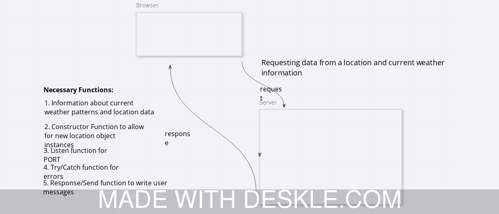
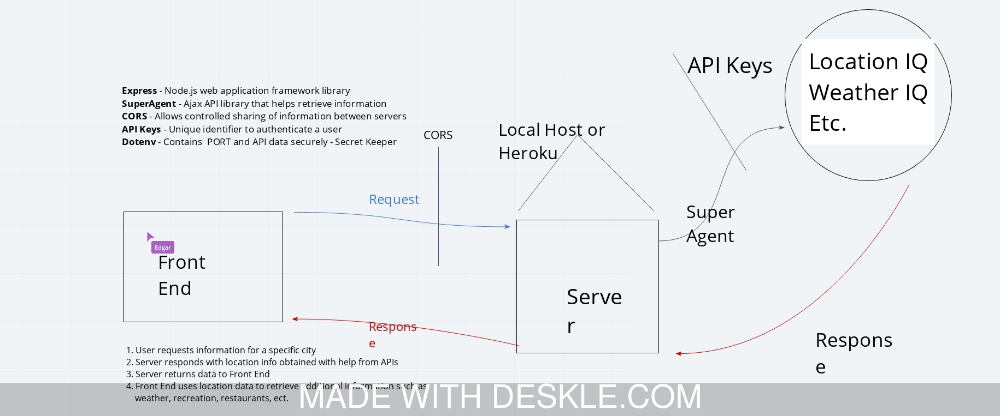
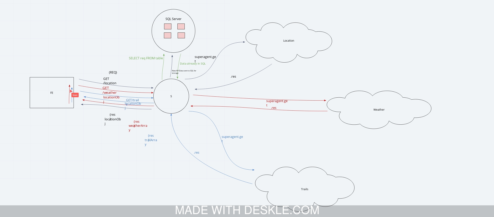

# city_explorer_api
City Explorer Server - Assignment 6

#### Team Whiteboard Work

**Author**: Steve Baldock
**Version**: 1.0.0 (increment the patch/fix version number if you make more commits past your first submission)

## Overview

* Travel is exciting, and it is nice to know a thing or two about a city 
  before arriving. This application allows a user to enter a city name, which returns a map of the area and local weather so that the traveler will have an idea of how to get around the city and what clothes to pack before departing. 

## Getting Started
* The user must begin by creating a new repository in GitHub to house working files and leverage when deploing the application using Heroku.
* After creating a repository, the user must intitialize a new NPM package with the terminal command `npm init`.
* Additionally, the user needs to initialize Express, which is a framework for node.js with the terminal command `npm i -S express`
* User must create a file structure that includes the following elements
  * server.js - JavaScript file to handle server requests from front user browser
  * package.json - NPM dependencies handling
  * package-lock.json - Locks dependencies to a specific version number
  * .eslintr.json - Delints JavaScript errors
  * .gitignore - Tells Git which files or folders to ignore in a project
  * Data Files
    * Location.json - Contains city location data
    * Weather.json - Contains weather API data
  * .env - Enables PORT on local machine
  * Node-Modules - JavaScript files reused through the application
* After creating a file structure, the user must call data from the `location.json` and `weather.json` files using `app.get` functions. 
* User must created appropriate error messages for failure within the two `app.get` functions, as well as outside of the functions for general errors. 
* The user must create a new Heroku application and utilize the URL from their deployed app (which speaks to GitHub for updates) in order for full deployment. 

## Architecture
* This application creates a backend server that accepts input from City Explorer, a frontend application. The server receives the input and responds with location information in the form or a map, along with local weather information for the city entered. The server contains longitude and latitude coordinates in order to produce a map of the city entered. Additionally, it contains an expansive set of weather data that allows the user to receive up to date information. 

* The application employs the use of a series of functions built to retrieve the data requested and push it back to the City Explorer application. Through the use of `app.get` functions and constructors, it can accept existing database locations and new locations (object instances).

## Change Log

* 06-08-2020 1:05PM - File structure complete and initial application deployed to Heroku

* 06-08-2020 2:45PM - Location data added, deployed and functional in City Explorer Frontend application

* 06-08-2020 4:45PM - Weather location and error message functions added, deployed and functional in City Explorer Frontend application

## Credits and Collaborations
* Colloration with Daisy Johnson and Kamit Satkeev on whiteboarding and some elements of file structure setup, troubleshooting, and code architecture

## Lab 6

#### Repository Setup

Number and name of feature: #1. Repository Setup

Estimate of time needed to complete: 1 Hour

Start time: 12:35 PM

Finish time: 1:35 PM

Actual time needed to complete: 30 Minutes

#### Locations

Number and name of feature: #2. Locations

Estimate of time needed to complete: 1 Hour

Start time: 1:15 PM

Finish time: 2:15 PM

Actual time needed to complete: 1.5 Hours

#### Weather

Number and name of feature: #3. Weather

Estimate of time needed to complete: 1 Hour

Start time: 2:45 PM

Finish time: 3:45 PM

Actual time needed to complete: 2 Hours

#### Errors

Number and name of feature: #4. Errors

Estimate of time needed to complete: 1 Hour

Start time: _____

Finish time: _____

Actual time needed to complete: _____

## Lab 7 - Tuesday, June 9

#### Data Formatting

Number and name of feature: #1 - Data Formatting

Estimate of time needed to complete: 1 Hour

Start time: 1:39PM

Finish time: 2:39 PM

Actual time needed to complete: 35 Minutes

#### Locations

Number and name of feature: #2 - Locations

Estimate of time needed to complete: 1 Hour

Start time: 2:40 PM

Finish time: 3:40 PM

Actual time needed to complete: 1 Hour

#### Weather

Number and name of feature: #3 - Weather

Estimate of time needed to complete: 1 Hour

Start time: 3:40 PM

Finish time:4:40 PM

Actual time needed to complete: 5:10 PM

#### Trails

Number and name of feature: #4 - Trails

Estimate of time needed to complete: 1 Hour

Start time: 4:45 PM

Finish time: 5:45 PM

Actual time needed to complete: 2 Hours, 15 Minutes

## Lab 8 - Wednesday, June

#### Database

Number and name of feature: #1 - DataBase

Estimate of time needed to complete: 1 Hour

Start time: 1:15 PM

Finish time: 2:15 PM

Actual time needed to complete: 45 Minutes

#### Server

Number and name of feature: #2 - Server

Estimate of time needed to complete: 1 Hour

Start time: 2:30 PM

Finish time: 3:30 PM

Actual time needed to complete: ________________

#### Deploy

Number and name of feature: #3 - Deploy

Estimate of time needed to complete: 1 Hour

Start time: 4:45 PM

Finish time: 5:45 PM

Actual time needed to complete: 2 Hours, 15 Minutes

#### Stretch

Number and name of feature: #4 - Stretch

Estimate of time needed to complete: 1 Hour

Start time: 4:45 PM

Finish time: 5:45 PM

Actual time needed to complete: 2 Hours, 15 Minutes